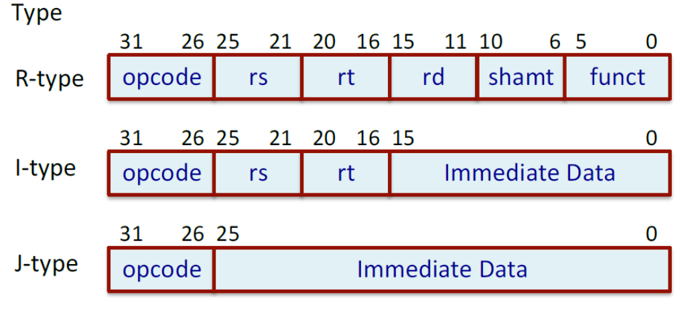
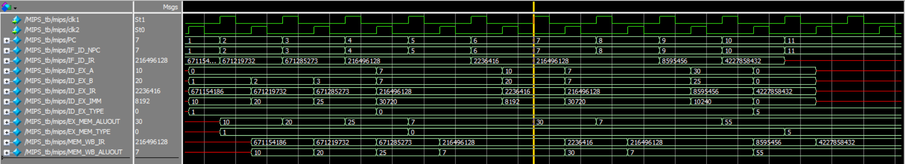
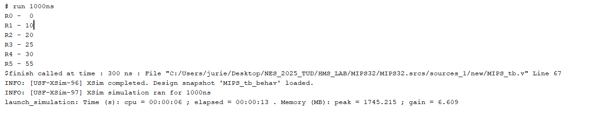

# MIPS32 5-Stage RISC Pipelined  Processor (Verilog Implementation)

## Overview

This project implements a simplified 32-bit RISC based MIPS processor using a
5-stage pipeline architecture in Verilog HDL.\
The design uses a two-phase clocking scheme (`clk1` and `clk2`) to model
pipeline behavior.

The processor supports arithmetic, logical, memory access, branch, and
halt instructions.

------------------------------------------------------------------------

## Pipeline Stages

### 1. Instruction Fetch (IF)

-   Fetches instruction from memory using Program Counter (PC).
-   Handles branch redirection.
-   Updates PC.
-   Pipeline registers: `IF_ID_IR`, `IF_ID_NPC`.

### 2. Instruction Decode (ID)

-   Reads register operands.
-   Sign-extends immediate values.
-   Determines instruction type.
-   Pipeline registers: `ID_EX_A`, `ID_EX_B`, `ID_EX_IMM`, `ID_EX_TYPE`.

### 3. Execute (EX)

-   Performs ALU operations.
-   Calculates branch target address.
-   Evaluates branch condition.
-   Pipeline registers: `EX_MEM_ALUOUT`, `EX_MEM_TYPE`, `EX_MEM_COND`.

### 4. Memory (MEM)

-   Performs memory read/write operations.
-   Handles HALT instruction.
-   Pipeline registers: `MEM_WB_ALUOUT`, `MEM_WB_LMB`, `MEM_WB_TYPE`.

### 5. Write Back (WB)

-   Writes results back into register file.

------------------------------------------------------------------------

## Instruction Encoding
[**Encoding Formats**]
 

## Supported Instructions

### R-Type (Register-Register ALU)

-   ADD
-   SUB
-   AND
-   OR
-   SLT
-   MUL

### I-Type (Register-Immediate ALU)

-   ADI
-   SUBI
-   SLTI

### Memory Instructions

-   LW (Load Word)
-   SW (Store Word)

### Branch Instructions

-   BEQZ (Branch if Equal to Zero)
-   BNEQZ (Branch if Not Equal to Zero)

### Control Instruction

-   HLT (Halts processor execution)

------------------------------------------------------------------------

## Internal Components

### Memory

-   1024 x 32-bit word memory
-   Modeled as: `reg [31:0] MEM[0:1023]`

### Register File

-   32 general-purpose 32-bit registers
-   Modeled as: `reg [31:0] REG[0:31]`

------------------------------------------------------------------------

## Special Signals

-   `HALTED` -- Indicates processor stop after HLT instruction.
-   `TAKEN_BRANCH` -- Used to disable invalid instruction after branch.
-   Two-phase clock:
    -   `clk1` → IF, EX, WB
    -   `clk2` → ID, MEM

------------------------------------------------------------------------

## Pipelined DataPath

## Features

-   5-stage pipeline architecture
-   Separate pipeline registers for each stage
-   Branch handling mechanism
-   Sign-extension for immediate values
-   Memory-mapped instruction/data storage
-   Simple hazard handling through branch control flag

------------------------------------------------------------------------

## Pipeline Hazards

- Structural Hazards due to shared hardware.
- Data Hazards due to instruction data dependency.
- Control hazards due to branch instructions.

------------------------------------------------------------------------

## Possible Improvements

-   Add hazard detection and stall logic
-   Implement jump instruction

--------------

## Test Case 

#### Steps:

1. Initialize register R1 with 10.
2. Initialize register R2 with 20.
3. Initialize register R3 with 25.
4. Add the three numbers and store the sum in R5.

#### Instructions

|   Assembly Instruction |	Machine Code                     |	Hexcode |
|   -------------------- |  -------------------------------- |  ------- |
|ADDI R1,R0,10	         |001010 00000 00001 0000000000001010|	2801000a|
|ADDI R2,R0,20	         |001010 00000 00010 0000000000010100|	28020014|
|ADDI R3,R0,25	         |001010 00000 00011 0000000000011000|  28030019|
|OR R7,R7,R7 (dummy)	 |001010 00000 00011 0000000000011001|	0ce77800|
|OR R7,R7,R7 (dummy)	 |001010 00000 00011 0000000000011001|	0ce77800|
|ADD R4,R1,R2	         |000000 00001 00010 00100 00000 000000|00222000|
|OR R7,R7,R7 (dummy)	 |001010 00000 00011 0000000000011001|	0ce77800|
|ADD R5,R4,R3	         |000000 00100 00011 00101 00000 000000|	00832800|
|HLT	                 |111111 00000 00000 00000 00000 000000|	fc000000|

## Output
[Waveform]

[TCL Console]

## Author

Juriel